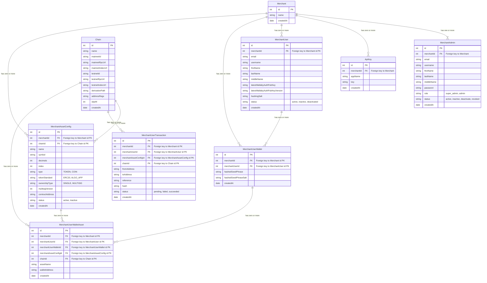

# Asset Management

- [Asset Management](#asset-management)
  - [Project Description](#project-description)
  - [User Types](#user-types)
  - [Features (Initial Scope)](#features-initial-scope)
    - [*1. Create a new Merchant*](#1-create-a-new-merchant)
      - [*1.1. Scenario 1*](#11-scenario-1)
        - [*1.1.1. Acceptance Critera*](#111-acceptance-critera)
        - [*1.1.2. Sequence Diagram*](#112-sequence-diagram)
    - [*2. Deactivate a Merchant*](#2-deactivate-a-merchant)
      - [*2.1. Scenario 1*](#21-scenario-1)
        - [*2.1.1. Acceptance Critera*](#211-acceptance-critera)
        - [*2.1.2. Sequence Diagram*](#212-sequence-diagram)
    - [*3. Active a Merchant*](#3-active-a-merchant)
      - [*3.1. Scenario 1*](#31-scenario-1)
        - [*3.1.1. Acceptance Critera*](#311-acceptance-critera)
        - [*3.1.2. Sequence Diagram*](#312-sequence-diagram)
    - [*4. Sign up as a Merchant*](#4-sign-up-as-a-merchant)
      - [*4.1. Scenario 1*](#41-scenario-1)
        - [*4.1.1. Acceptance Critera*](#411-acceptance-critera)
        - [*4.1.2. Sequence Diagram*](#412-sequence-diagram)
    - [*5. Invite Merchant Admins*](#5-invite-merchant-admins)
      - [*5.1. Scenario 1*](#51-scenario-1)
        - [*5.1.1. Acceptance Critera*](#511-acceptance-critera)
        - [*5.1.2. Sequence Diagram*](#512-sequence-diagram)
    - [*6. Revoke a Merchant Admin*](#6-revoke-a-merchant-admin)
      - [*6.1. Scenario 1*](#61-scenario-1)
        - [*6.1.1. Acceptance Critera*](#611-acceptance-critera)
        - [*6.1.2. Sequence Diagram*](#612-sequence-diagram)
    - [*7. Create API Keys*](#7-create-api-keys)
      - [*7.1. Scenario 1*](#71-scenario-1)
        - [*7.1.1. Acceptance Critera*](#711-acceptance-critera)
        - [*7.1.2. Sequence Diagram*](#712-sequence-diagram)
    - [*8. Create Assets*](#8-create-assets)
      - [*8.1. Scenario 1*](#81-scenario-1)
        - [*8.1.1. Acceptance Critera*](#811-acceptance-critera)
        - [*8.1.2. Sequence Diagram*](#812-sequence-diagram)
  - [ERD Diagram](#erd-diagram)
## Project Description

## User Types

- Wallaby Admin: The Wallaby user who will be able to deactive and activate merchant accounts
- Merchant Super Admin: The merchant user that owers the account. They can be one or many. The merchant will always have at least one Super Admin
- Merchant Admin: The merchant with less privileges than the Super Admin
## Features (Initial Scope)

### *1. Create a new Merchant*

#### *1.1. Scenario 1*

As a Wallaby Admin I want to create a new merchant account so that the Merchant can add users, create wallets, manage transactions etc.

##### *1.1.1. Acceptance Critera*

*GIVEN* I'm a Wallaby Admin  
*WHEN* I submit a new Merchant details  
*THEN* A new merchant account is created and an email is send to the email merchant

##### *1.1.2. Sequence Diagram*

### *2. Deactivate a Merchant*

#### *2.1. Scenario 1*

As a Wallaby Admin I want to deactivate a merchant account so that the Merchant stops having access to account.

##### *2.1.1. Acceptance Critera*

*GIVEN* I'm a Wallaby Admin  
*WHEN* I deactivate a Merchant account  
*THEN* The Merchant should stop having access to the account

##### *2.1.2. Sequence Diagram*

### *3. Active a Merchant*

#### *3.1. Scenario 1*

As a Wallaby Admin I want to active a merchant from a revoked or inactive state so that the Merchant can start or resume having access to account.

##### *3.1.1. Acceptance Critera*

*GIVEN* I'm a Wallaby Admin  
*WHEN* I activate a Merchant account  
*THEN* The Merchant should start or resume having access to the account

##### *3.1.2. Sequence Diagram*

### *4. Sign up as a Merchant*

#### *4.1. Scenario 1*

##### *4.1.1. Acceptance Critera*
As a new Merchant I want to sign up so that I can add users, create wallets, etc.

*GIVEN* I'm a new Merchant  
*WHEN* I submit my company details  
*THEN* My submission requests goes to pending review
##### *4.1.2. Sequence Diagram*

 

### *5. Invite Merchant Admins*

#### *5.1. Scenario 1*

As a *Merchant Super Admin* I want to invite new admins to that they can access the merchant overal information (users, wallets, transactions, etc)

##### *5.1.1. Acceptance Critera*

*GIVEN* A Merchant Super Admin  
*WHEN* I invite new admins  
*THEN* They should be able to access the merchant overal information (users, wallets, transactions, etc)

##### *5.1.2. Sequence Diagram*

### *6. Revoke a Merchant Admin*

#### *6.1. Scenario 1*

As a Merchant Super Admin I want to revoke an admin account so that they can stop having access to account.

##### *6.1.1. Acceptance Critera*

*GIVEN* I'm a Merchant Super Admin  
*WHEN* I revoke a Merchant admin  
*THEN* The admin should stop having access to the account

##### *6.1.2. Sequence Diagram*

 

### *7. Create API Keys*

#### *7.1. Scenario 1*

As a *Merchant Super Admin* I want to create new API Keys that I can be able to do external integration to the wallet

##### *7.1.1. Acceptance Critera*

*GIVEN* A Merchant Super Admin  
*WHEN* I submit create a new API Key request 
*THEN* The system should create a new API Key available for integration

##### *7.1.2. Sequence Diagram*

 

### *8. Create Assets*

#### *8.1. Scenario 1*

As a *Merchant Super Admin* I want to create new Assets that they can be used when creating new wallets

##### *8.1.1. Acceptance Critera*

*GIVEN* A Merchant Super Admin  
*WHEN* I submit create a new Asset Config request 
*THEN* The system should create a new Asset available for new wallet creation

##### *8.1.2. Sequence Diagram*

 

## ERD Diagram

